# OpenVisionKit Architecture and Data Flow

```mermaid
graph TD
    %% Input Layer
    subgraph "INPUT LAYER"
        VideoFile[Video File<br/>mp4/avi/mov/etc]
        Camera[Camera Device<br/>Webcam/Capture Card]
        OBSSource[OBS Studio Source<br/>Scene/Window/Display]
    end

    %% Data Ingestion
    VideoFrame[VideoFrame<br/>cv::UMat + metadata<br/>timestamp + format]

    %% Format Conversion
    ConversionFilter[ConversionFilter<br/>BGR ↔ YUV ↔ RGB<br/>Format standardization]

    %% Filter Chain Manager
    CompositeFilter[CompositeFilter<br/>Sequential filter processing<br/>Chain management]

    %% Enhancement Processing
    subgraph "ENHANCEMENT PROCESSING"
        DeblockingFilter[DeblockingFilter<br/>Adaptive deblocking<br/>Artifact removal]
        ScalingFilter[ScalingFilter<br/>FSR algorithms<br/>Resolution scaling]
        ColorEnhancement[Color Enhancement<br/>Contrast adjustment<br/>Brightness optimization]
    end

    %% Geometric Processing
    subgraph "GEOMETRIC PROCESSING"
        StabilizationFilter[StabilizationFilter<br/>Motion compensation<br/>Path smoothing]
        LensCorrection[Lens Correction<br/>Distortion correction<br/>Geometric adjustment]
        WarpMesh[WarpMesh<br/>Mesh-based warping<br/>Perspective correction]
    end

    %% Computer Vision Engine
    subgraph "COMPUTER VISION ENGINE"
        FeatureDetector[FeatureDetector<br/>SIFT/ORB/AKAZE<br/>Feature matching]
        FrameTracker[FrameTracker<br/>Optical flow<br/>Motion tracking]
        PathSmoother[PathSmoother<br/>Kalman filtering<br/>Trajectory smoothing]
        CameraCalibrator[CameraCalibrator<br/>Intrinsic parameters<br/>Distortion coefficients]
        Homography[Homography<br/>Perspective transforms<br/>Geometric mapping]
    end

    %% GPU Acceleration Layer
    subgraph "GPU ACCELERATION LAYER"
        OpenCLKernels[OpenCL Kernels<br/>Parallel processing<br/>GPU compute]
        MacOSAccel[macOS Acceleration<br/>Metal Performance Shaders<br/>Core Video integration]
        UMatOps[cv::UMat Operations<br/>Automatic GPU/CPU fallback<br/>Memory management]
    end

    %% Application Interface Layer
    subgraph "APPLICATION INTERFACE LAYER"
        direction TB
        OBSInterop[OBS Interop Layer<br/>Plugin lifecycle<br/>Source management]
        VideoProcessor[VideoProcessor<br/>Batch processing<br/>CLI interface]
    end

    %% Configuration and Parsing
    subgraph "CONFIGURATION LAYER"
        FilterParser[FilterParser<br/>Command-line parsing<br/>Filter configuration]
        OptionParser[OptionParser<br/>Argument validation<br/>Parameter setup]
        VideoIOConfig[VideoIOConfiguration<br/>Input/output setup<br/>Codec configuration]
    end

    %% Data Storage
    subgraph "DATA STORAGE LAYER"
        StreamBuffer[StreamBuffer<br/>Circular buffering<br/>Frame queuing]
        SpatialMap[SpatialMap<br/>Spatial data structures<br/>Tracking information]
    end

    %% Utility Systems
    subgraph "UTILITY SYSTEMS"
        Logger[Logging System<br/>CSV/Console output<br/>Performance metrics]
        Timing[Timing System<br/>Stopwatch/TickTimer<br/>Real-time monitoring]
        ConfigSystem[Configuration System<br/>Settings management<br/>Parameter validation]
    end

    %% Output Layer
    subgraph "OUTPUT LAYER"
        ProcessedVideo[Processed Video File<br/>Enhanced output<br/>Multiple formats]
        OBSOutput[OBS Studio Output<br/>Live streaming<br/>Real-time processing]
        RealTimeDisplay[Real-time Display<br/>Preview window<br/>Monitoring interface]
    end

    %% Main Data Flow (Vertical)
    VideoFile --> VideoFrame
    Camera --> VideoFrame
    OBSSource --> OBSInterop
    OBSInterop --> VideoFrame
    
    VideoFrame --> ConversionFilter
    ConversionFilter --> CompositeFilter
    
    CompositeFilter --> DeblockingFilter
    CompositeFilter --> ScalingFilter
    CompositeFilter --> ColorEnhancement
    CompositeFilter --> StabilizationFilter
    CompositeFilter --> LensCorrection
    CompositeFilter --> WarpMesh
    
    %% Computer Vision Integration
    StabilizationFilter --> FeatureDetector
    StabilizationFilter --> FrameTracker
    FrameTracker --> PathSmoother
    LensCorrection --> CameraCalibrator
    LensCorrection --> Homography
    WarpMesh --> Homography
    
    %% Data Storage Integration
    VideoFrame --> StreamBuffer
    FrameTracker --> SpatialMap
    
    %% GPU Acceleration (dotted connections)
    DeblockingFilter -.-> OpenCLKernels
    ScalingFilter -.-> OpenCLKernels
    StabilizationFilter -.-> UMatOps
    LensCorrection -.-> MacOSAccel
    ColorEnhancement -.-> UMatOps
    
    %% Application Layer Integration
    VideoFrame --> VideoProcessor
    VideoProcessor --> FilterParser
    FilterParser --> OptionParser
    OptionParser --> VideoIOConfig
    
    %% Processing to Output
    DeblockingFilter --> ProcessedVideo
    ScalingFilter --> OBSOutput
    ColorEnhancement --> RealTimeDisplay
    StabilizationFilter --> OBSOutput
    LensCorrection --> ProcessedVideo
    
    VideoProcessor --> ProcessedVideo
    OBSInterop --> OBSOutput
    
    %% Utility Connections (dotted)
    VideoProcessor -.-> Logger
    CompositeFilter -.-> Timing
    VideoProcessor -.-> ConfigSystem
    OBSInterop -.-> Logger
    StabilizationFilter -.-> Timing

    %% Styling
    classDef inputNode fill:#e1f5fe,stroke:#01579b,stroke-width:2px
    classDef coreData fill:#f3e5f5,stroke:#4a148c,stroke-width:2px
    classDef processing fill:#e8f5e8,stroke:#1b5e20,stroke-width:2px
    classDef vision fill:#fff3e0,stroke:#e65100,stroke-width:2px
    classDef gpu fill:#fce4ec,stroke:#880e4f,stroke-width:2px
    classDef module fill:#e0f2f1,stroke:#004d40,stroke-width:2px
    classDef output fill:#f1f8e9,stroke:#33691e,stroke-width:2px
    classDef utility fill:#fafafa,stroke:#424242,stroke-width:2px

    class VideoFile,Camera,OBSSource inputNode
    class VideoFrame,ConversionFilter,CompositeFilter coreData
    class DeblockingFilter,ScalingFilter,ColorEnhancement,StabilizationFilter,LensCorrection,WarpMesh processing
    class FeatureDetector,FrameTracker,PathSmoother,CameraCalibrator,Homography vision
    class OpenCLKernels,MacOSAccel,UMatOps gpu
    class OBSInterop,VideoProcessor,FilterParser,OptionParser,VideoIOConfig module
    class ProcessedVideo,OBSOutput,RealTimeDisplay output
    class Logger,Timing,ConfigSystem,StreamBuffer,SpatialMap utility
```



## Key Architecture Principles

### 1. **Modular Filter-Based Design**
- All video processing is built around the `VideoFilter` base class
- Filters can be chained together using `CompositeFilter`
- Each filter is responsible for a specific transformation or enhancement

### 2. **Real-Time Performance Constraints**
- Target processing time: <33ms per frame (30fps)
- GPU acceleration via OpenCL and platform-specific optimizations
- Automatic fallback from GPU to CPU operations

### 3. **Cross-Platform Architecture**
- Core library (`OpenVisionKit/`) is platform-agnostic
- Platform-specific optimizations in dedicated modules
- CMake-based build system with platform detection

### 4. **Data Flow Pattern**
```
Input Source → VideoFrame → Filter Chain → Enhanced VideoFrame → Output Destination
```

### 5. **Thread Safety & Concurrency**
- All filters must be thread-safe or clearly documented
- OpenCV operations require careful synchronization
- GPU context management for concurrent operations

### 6. **Memory Management**
- RAII patterns throughout the codebase
- Smart pointers for resource management
- OpenCV's `cv::UMat` for GPU-accelerated operations

## Performance Monitoring

The system includes comprehensive performance monitoring:
- **Stopwatch**: High-precision timing for individual operations
- **TickTimer**: Frame rate timing and regulation
- **CSVLogger**: Performance data logging for analysis
- **Real-time metrics**: Processing time per frame tracking